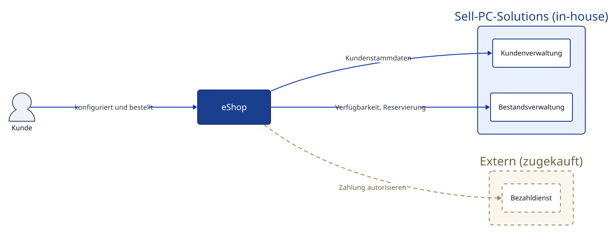

# Kontextabgrenzung {#section-context-and-scope}

## Fachlicher Kontext {#_fachlicher_kontext}

### Kontextdiagramm {#_kontextdiagramm}



Der eShop ist das betrachtete System, alle übrigen Kästen sind Nachbarsysteme
außerhalb der eigenen Verantwortung. Kundenverwaltung und Bestandsverwaltung
sind bestehende Systeme aus dem Offline-Geschäft und werden weiterbenutzt, der
Bezahldienst wird zugekauft.

Quelle des Diagramms: [`diagrams/03-kontext.d2`](diagrams/03-kontext.d2)
([D2](https://d2lang.com)). Nach einer Änderung neu rendern mit:

```sh
d2 --theme 0 --pad 20 eshop/diagrams/03-kontext.d2 eshop/diagrams/03-kontext.svg
```

**\<optional: Erläuterung der externen fachlichen Schnittstellen\>**

## Technischer Kontext {#_technischer_kontext}

**\<Diagramm oder Tabelle\>**

**\<optional: Erläuterung der externen technischen Schnittstellen\>**

**\<Mapping fachliche auf technische Schnittstellen\>**
