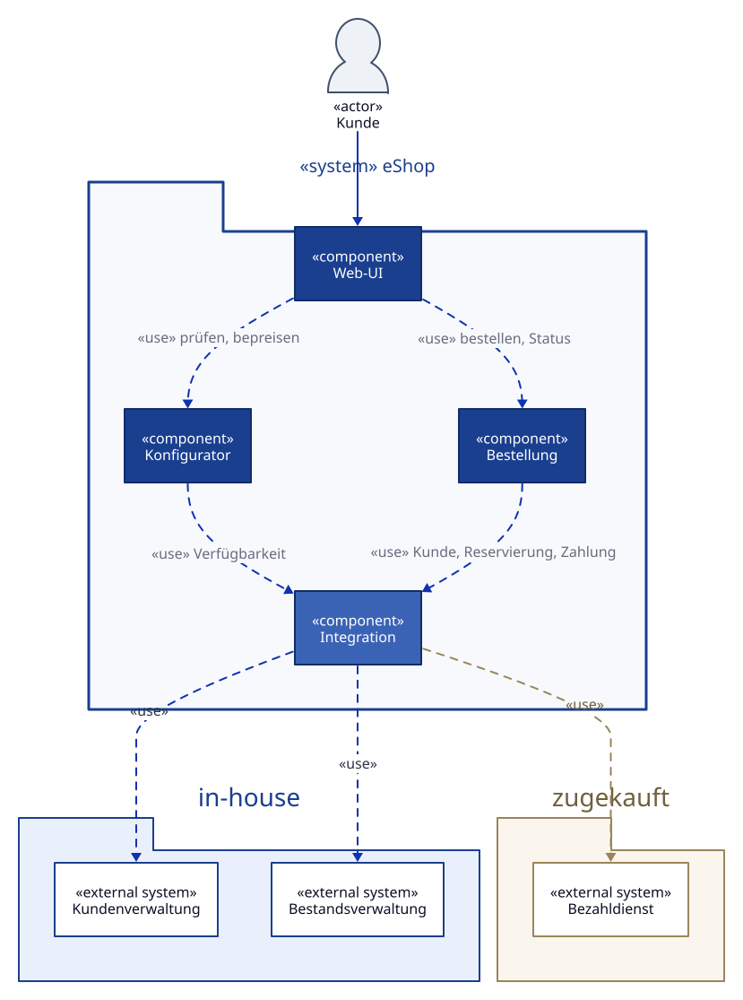

# Bausteinsicht {#section-building-block-view}

## Whitebox Gesamtsystem {#_whitebox_gesamtsystem}

**Notation:** UML-Komponentendiagramm, gleiche Konventionen wie die
Kontextabgrenzung in [Kapitel 3](03_context_and_scope.md). Die vier `«component»`
im Paket `«system» eShop` sind die Bausteine der Ebene 1.

Quelle: [`diagrams/05-bausteinsicht.d2`](diagrams/05-bausteinsicht.d2) ([D2](https://d2lang.com)).
Alle Diagramme neu rendern mit [`diagrams/render.sh`](diagrams/render.sh).

**Begründung**

Der Zuschnitt folgt unmittelbar dem Qualitätsziel der Modularisierung: Bestellung,
Konfiguration, GUI und die Integration mit externen Systemen sollen mit wenig
Aufwand austauschbar sein. Genau diese vier Verantwortlichkeiten sind deshalb je
ein eigener Baustein — die Qualitätsanforderung ist damit in der Struktur
sichtbar und nicht nur in Kapitel 10 behauptet.

Die Integration ist bewusst **ein** Baustein und nicht auf die Fachbausteine
verteilt. So gibt es genau eine Stelle im System, die die Eigenheiten der
Fremdsysteme kennt. Ein Wechsel des Bezahldienstes bleibt dadurch lokal, statt
sich durch die Bestellabwicklung zu ziehen.

**Enthaltene Bausteine**

| Baustein | Verantwortung |
|----------|---------------|
| Web-UI | Darstellung und Benutzerführung im Browser des Kunden |
| Konfigurator | Gültigkeit, Vollständigkeit und Preis einer Rechnerkonfiguration |
| Bestellung | Ablauf vom Warenkorb bis zur bestätigten Bestellung, Zustand einer Bestellung |
| Integration | Zugriff auf Kundenverwaltung, Bestandsverwaltung und Bezahldienst |

**Wichtige Schnittstellen**

| Schnittstelle | Zweck |
|---------------|-------|
| Web-UI → Backend | Einzige Verbindung zwischen Oberfläche und Fachlogik, laut Randbedingung über REST/http |
| Konfigurator → Integration | Verfügbarkeit einzelner Komponenten während der Konfiguration |
| Bestellung → Integration | Kundenstammdaten, Reservierung von Komponenten, Zahlungsauftrag |
| Integration → Nachbarsysteme | Je ein Adapter pro Nachbarsystem; siehe Kontextabgrenzung in [Kapitel 3](03_context_and_scope.md) |

### Web-UI {#_web_ui}

*Zweck/Verantwortung*

Stellt Konfiguration, Warenkorb und Bestellabschluss im Browser dar und führt den
Kunden durch den Ablauf. Enthält keine Fachlogik — welche Konfiguration gültig
ist, entscheidet der Konfigurator, nicht die Oberfläche.

*Schnittstellen*

Nach außen der Browser des Kunden, nach innen REST/http zum Backend.

*Qualitäts-/Leistungsmerkmale*

Trägt die Qualitätsziele „intuitive Benutzerführung" und „Lokalisierbarkeit".
Für Letzteres dürfen Texte nicht im Code stehen, sondern müssen aus einer
austauschbaren Quelle kommen.

*Offene Punkte*

Ob die Oberfläche auch für mobile Geräte ausgelegt sein muss, ist in Kapitel 1
noch offen und beeinflusst diesen Baustein am stärksten.

### Konfigurator {#_konfigurator}

*Zweck/Verantwortung*

Prüft, ob eine vom Kunden zusammengestellte Konfiguration technisch möglich ist,
ergänzt Pflichtbestandteile und berechnet den Preis.

*Schnittstellen*

Nimmt Konfigurationswünsche von der Web-UI entgegen, fragt Verfügbarkeiten über
die Integration ab.

*Offene Punkte*

Woher die Kompatibilitätsregeln stammen und wer sie pflegt, ist bisher nicht
festgelegt. Das ist die größte inhaltliche Lücke in diesem Baustein.

### Bestellung {#_bestellung}

*Zweck/Verantwortung*

Führt den Bestellvorgang vom Warenkorb bis zur Bestätigung und hält den Zustand
einer Bestellung. Verantwortet insbesondere das Zusammenspiel von Reservierung
und Zahlung, einschließlich der Rücknahme einer Reservierung bei fehlgeschlagener
Zahlung.

*Schnittstellen*

Web-UI für Auslösen und Statusabfrage, Integration für Kundendaten, Reservierung
und Zahlung.

*Offene Punkte*

Storno und Rückabwicklung nach erfolgreicher Bestellung sind nicht beauftragt.
Falls sie später dazukommen, betrifft das vor allem diesen Baustein.

### Integration {#_integration}

*Zweck/Verantwortung*

Kapselt den Zugriff auf die drei Nachbarsysteme hinter fachlichen Schnittstellen.
Je Nachbarsystem ein Adapter, der Protokoll, Datenformat und Fehlerverhalten des
Fremdsystems auf die Begriffe des eShops übersetzt.

*Schnittstellen*

Kundenverwaltung, Bestandsverwaltung, Bezahldienst.

*Qualitäts-/Leistungsmerkmale*

Trägt das Qualitätsziel der Austauschbarkeit. Der Test dafür ist konkret: ein
zweiter Bezahldienst muss sich ergänzen lassen, ohne Konfigurator oder Bestellung
anzufassen.

*Offene Punkte*

Was geschieht, wenn ein Nachbarsystem nicht erreichbar ist? Für die
Bestandsverwaltung und den Bezahldienst hat das unmittelbar fachliche Folgen und
ist noch nicht entschieden.

## Ebene 2 {#_ebene_2}

TODO — Übung: Zerlegen Sie mindestens einen Baustein der Ebene 1 weiter. Am
ergiebigsten sind *Bestellung* (Zustände einer Bestellung) und *Integration*
(je ein Adapter pro Nachbarsystem).

### Whitebox *\<Baustein 1\>* {#_whitebox_baustein_1}

*\<Whitebox-Template\>*

## Ebene 3 {#_ebene_3}

TODO — Übung: Nur dort ausfüllen, wo Ebene 2 nicht ausreicht. Für den eShop in
diesem Umfang voraussichtlich nicht nötig; arc42 verlangt keine Vollständigkeit,
sondern Angemessenheit.
