# Laufzeitsicht {#section-runtime-view}

Dokumentiert sind zwei Szenarien: das häufigste und das riskanteste. Das erste
zeigt den Normalfall der Konfiguration, das zweite die Bestellung mit Zahlung —
dort greifen zwei Nachbarsysteme ineinander, und dort entsteht der Zustand, den
das System falsch machen kann.

Nicht jedes denkbare Szenario gehört in dieses Kapitel. arc42 verlangt die
wenigen, an denen sich das Zusammenspiel der Bausteine wirklich erklärt.

**Notation:** UML-Sequenzdiagramme. Die senkrechten Balken auf den Lebenslinien
sind Aktivierungen — sie zeigen, welcher Baustein gerade die Kontrolle hat. Das
`alt`-Fragment im zweiten Szenario trennt die beiden möglichen Ausgänge; die
Bedingung steht jeweils in eckigen Klammern.

Beide Szenarien sind zusätzlich als **animierte SVG** eingebunden: der Ablauf baut
sich Schritt für Schritt auf, statt fertig dazustehen. Für die Schulung ist das der
Unterschied zwischen „hier ist der Ablauf" und dem gemeinsamen Durchgehen. Wer die
Kapitel druckt oder in ein PDF überführt, nimmt die daneben verlinkten Standbilder.

## Rechner konfigurieren {#_rechner_konfigurieren}

Das Diagramm baut sich in vier Schritten auf. Standbild für Druck und PDF:
[`06-laufzeit-konfiguration.svg`](diagrams/06-laufzeit-konfiguration.svg) ·
Quelle: [`06-laufzeit-konfiguration.d2`](diagrams/06-laufzeit-konfiguration.d2)

Bemerkenswert am Ablauf ist, wo die Entscheidung fällt: Ob eine Konfiguration
gültig ist, entscheidet der Konfigurator, nicht die Oberfläche. Die Web-UI
stellt nur dar. Damit bleibt die Regel auch dann erhalten, wenn die Oberfläche
später ausgetauscht oder um einen zweiten Kanal ergänzt wird.

Die Verfügbarkeitsabfrage läuft bei jeder Änderung des Kunden erneut. Das ist der
Pfad, der die Anforderung von 10.000 gleichzeitigen Benutzern am stärksten
belastet, und damit der erste Kandidat für Zwischenspeicherung. Ob und wie
zwischengespeichert wird, ist noch nicht entschieden.

## Bestellung aufgeben und bezahlen {#_bestellung_aufgeben_und_bezahlen}

Das Diagramm baut sich in fünf Schritten auf; der letzte zeigt beide Zweige des
`alt`-Fragments. Standbild für Druck und PDF:
[`06-laufzeit-bestellung.svg`](diagrams/06-laufzeit-bestellung.svg) ·
Quelle: [`06-laufzeit-bestellung.d2`](diagrams/06-laufzeit-bestellung.d2)

Der Kern des Szenarios ist die Reihenfolge von Reservierung und Zahlung. Die
Reservierung geht der Zahlung voraus, damit dem Kunden nichts verkauft wird, was
nicht mehr da ist. Damit entsteht aber eine Verpflichtung: Scheitert die Zahlung,
muss die Reservierung wieder freigegeben werden. Genau das zeigt der zweite Block
im Diagramm.

Zwei Systeme, zwei Zustände, keine gemeinsame Transaktion — Bestandsverwaltung
und Bezahldienst wissen nichts voneinander. Die Klammer darum liegt allein beim
Baustein *Bestellung*.

**Offener Punkt: der dritte Ausgang.** Das Diagramm zeigt Zustimmung und
Ablehnung. Der Bezahldienst kann aber auch mit einer Zeitüberschreitung
antworten. Dann ist der Ausgang der Zahlung nicht negativ, sondern *unbekannt* —
die Reservierung darf weder blind gehalten noch blind freigegeben werden. Dieser
Fall ist bewusst noch nicht gezeichnet, weil er noch nicht entschieden ist; er
gehört zu den Risiken in Kapitel 11.

## Weitere Szenarien {#_weitere_szenarien}

TODO — Übung: Ergänzen Sie ein Szenario Ihrer Wahl. Naheliegende Kandidaten sind
der Neukunde, der beim Bestellabschluss erst in der Kundenverwaltung angelegt
werden muss, und der Ausfall eines Nachbarsystems.
